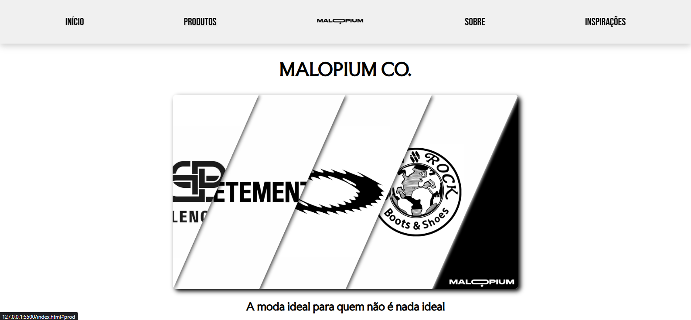
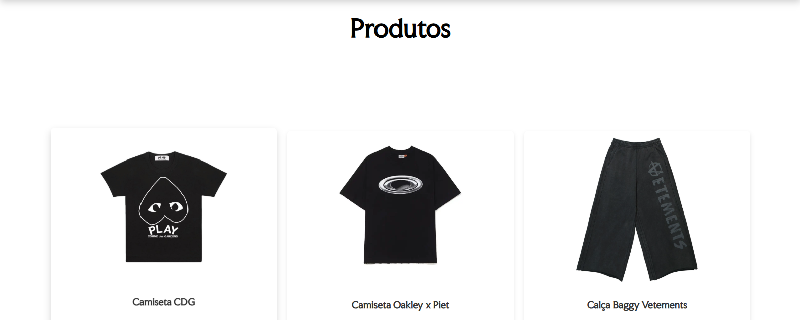
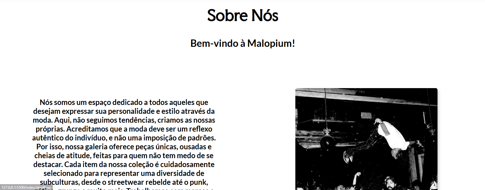
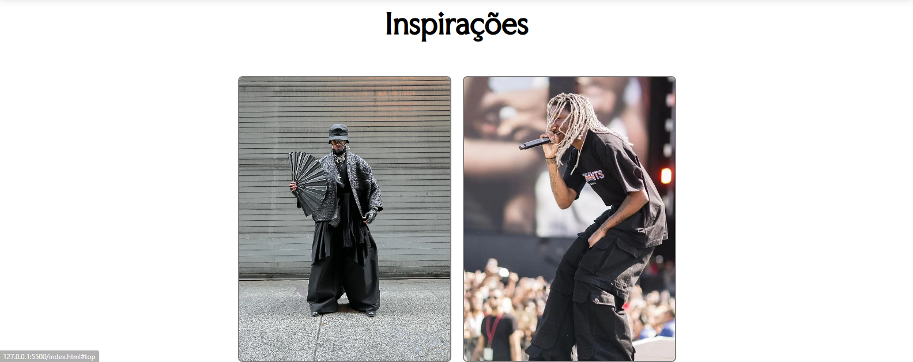

# Malopium - Galeria/Loja de High Fashion

Bem-vindo ao **Malopium**, uma loja conceitual de moda alternativa e high fashion feita inteiramente com **HTML, CSS e JavaScript puro**. Este site representa uma experiência visual ousada e uma interface funcional para exibição e encomenda de peças únicas.

## 🧩 Funcionalidades

- **Homepage estilizada** com apresentação da marca e galeria de produtos.
- **Navegação fluida** entre seções: Produtos, Sobre, Inspirações.
- **Formulário de encomenda** com visualização dinâmica da peça selecionada.
- **Design responsivo** para dispositivos móveis e desktop.
- **Validação de formulário** com feedback ao usuário.

## 🖼️ Preview

Inicio do site


Catalogo de produtos


Sobre


Área de inspirações


## 📂 Estrutura de Diretórios

```
Malopium/
├── index.html           # Página inicial da loja
├── form.html            # Página de encomenda
├── scripts/
│   └── script.js        # JS para troca de imagem e validação do formulário
├── styles/
│   ├── styles.css       # Estilos da homepage
│   └── styles2.css      # Estilos do formulário
├── imagens/             # Logos, banners e imagens institucionais
├── imagens_produtos/    # Fotos das peças disponíveis
```

## 💻 Tecnologias Utilizadas

- HTML5
- CSS3 (com media queries para responsividade)
- JavaScript Vanilla (sem frameworks)
- Google Fonts: `Bebas Neue`, `Faculty Glyphic`, `Lato`

## 📦 Como Rodar Localmente

1. Clone este repositório:
   ```bash
   git clone https://github.com/seu-usuario/malopium.git
   ```
2. Abra o arquivo `index.html` no navegador.

> Nenhum servidor é necessário, pois é um projeto totalmente estático.

## 📬 Formulário

A página `form.html` permite que o usuário selecione uma peça, informe seu e-mail e endereço, e envia uma encomenda fictícia. O envio é simulado com um `alert()` de confirmação.

## 🌐 Responsividade

Ambas as páginas são totalmente adaptadas para diferentes tamanhos de tela, usando **media queries**.

## ✨ Possíveis Melhorias Futuras

- Integração com backend (ex: Firebase, Node.js) para processar pedidos reais.
- Integração com banco de dados
- Adição de sistema de login/registro.
- Carrinho de compras.
- Filtragem e categorização de produtos.
- Sistema de newsletter.

## 📸 Créditos

As imagens utilizadas são apenas para fins demonstrativos.

---

## 🧑‍💻 Desenvolvedor

Feito por Luan Patrique 
[🔗 LinkedIn](https://www.linkedin.com/in/luan-patrique-75997b315/) | [📧 Email](luan.patrique20@gmail.com)
